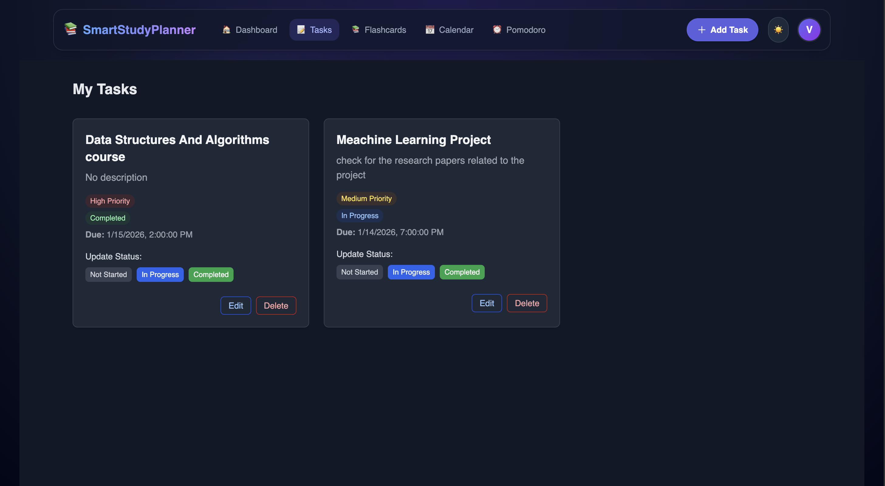
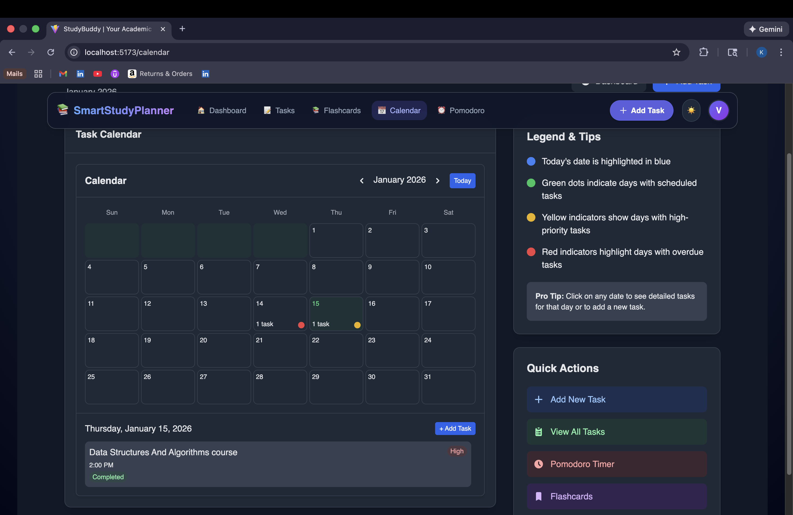
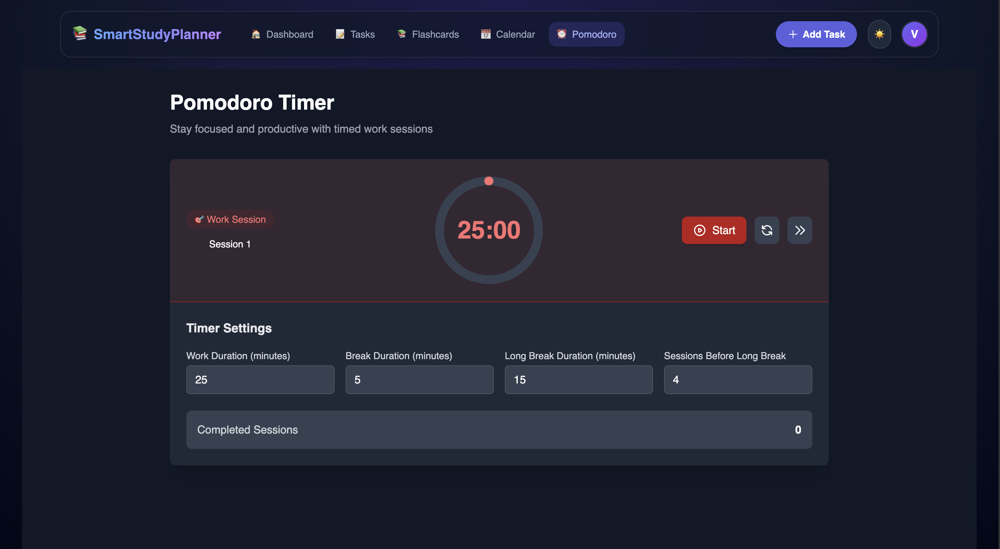

# 📚 Smart Study Planner

A comprehensive full-stack productivity application designed to help students and professionals manage their study schedules, track progress, and boost learning efficiency through intelligent task management and spaced repetition techniques.


---

## 📸 Application Screenshots

### Dashboard - Progress Overview


_Comprehensive dashboard displaying task statistics, completion rates, current streaks, and daily task overview with personalized greetings_

**Key Metrics Visible:**

- Total tasks, completed, in progress, and not started counts
- Current streak and best streak tracking with gamification elements
- Real-time completion rate with visual progress bar
- Today's tasks with priority indicators
- Quick actions panel for easy navigation

---

### Task Management System


_Intuitive task cards showing priority levels, status tracking, due dates, and quick action buttons_

**Features Demonstrated:**

- Task cards with clear priority indicators (High, Medium)
- Status management (Not Started, In Progress, Completed)
- Due date tracking with timestamps
- Task descriptions and details
- Edit and delete functionality
- Real-time status updates

---

### Interactive Calendar View


_Visual calendar interface with color-coded task indicators and detailed daily task breakdowns_

**Calendar Features:**

- Monthly view with task indicators
- Color-coded priority system:
  - 🔵 Blue: Current date
  - 🟢 Green: Days with scheduled tasks
  - 🟡 Yellow: High-priority tasks
  - 🔴 Red: Overdue tasks
- Click-to-view daily task details
- Legend and tips panel for easy navigation
- Quick actions sidebar

---

### Pomodoro Timer


_Built-in Pomodoro timer with customizable work/break sessions to enhance focus and productivity_

**Timer Features:**

- 25-minute default work sessions
- Customizable work duration
- Break duration settings (5-minute short, 15-minute long breaks)
- Session tracking before long breaks
- Completed sessions counter
- Visual timer with start/reset/skip controls
- Session type indicator

---

## ✨ Key Features

### 🔐 Authentication & Security

- Secure user registration and login
- JWT-based authentication
- Bcrypt password hashing
- Protected routes and session management

### 📊 Dashboard & Analytics

- **Progress Overview:** Visual representation of task completion
- **Task Statistics:** Total, completed, in-progress, and pending tasks
- **Streak Tracking:** Current and best streak with gamification
- **Completion Rate:** Real-time progress bar with percentage
- **Today's Tasks:** Quick view of daily priorities

### 📝 Task Management

- **Task Creation:** Add tasks with titles, descriptions, priorities, and due dates
- **Status Tracking:** Not Started, In Progress, Completed states
- **Priority Levels:** High, Medium, Low with color coding
- **Task Editing:** Modify task details on the fly
- **Task Deletion:** Remove completed or unnecessary tasks
- **Real-time Updates:** Instant synchronization across dashboard and task views

### 📅 Calendar Integration

- **Monthly View:** Visual representation of all tasks
- **Date Highlighting:** Color-coded indicators for different task types
- **Daily Details:** Click any date to view specific tasks
- **Task Creation:** Add new tasks directly from calendar
- **Legend System:** Clear visual guides for task types

### 🍅 Pomodoro Timer

- **Customizable Sessions:** Adjust work and break durations
- **Session Tracking:** Monitor completed Pomodoro sessions
- **Break Management:** Automatic short and long break scheduling
- **Visual Feedback:** Circular timer with real-time countdown
- **Control Options:** Start, reset, and skip functionality

### 🧠 Additional Features

- **Flashcards:** Spaced repetition system for learning (visible in navigation)
- **Responsive Design:** Works seamlessly on desktop and mobile devices
- **Modern UI/UX:** Clean interface with smooth animations
- **Dark Theme:** Eye-friendly dark mode throughout the application
- **Notification System:** Stay updated on tasks and deadlines

---

## 🚀 Tech Stack

### Frontend

- **React 18.2.0** with Vite - Fast, modern development experience
- **Tailwind CSS** - Utility-first styling
- **Tw-Elements-React** - Enhanced UI components
- **Framer Motion** - Smooth animations and transitions
- **React Router DOM** - Client-side routing
- **Axios** - HTTP client for API requests

### Backend

- **Node.js** - JavaScript runtime
- **Express.js** - Web application framework
- **MongoDB** - NoSQL database
- **Mongoose** - MongoDB object modeling
- **JSON Web Token (JWT)** - Secure authentication
- **Bcrypt** - Password hashing
- **Nodemailer** - Email service integration
- **Node-Cron** - Scheduled task automation

---

## ⚙️ Installation & Setup

### Prerequisites

- **Node.js** (v14 or higher)
- **MongoDB** (Local installation or MongoDB Atlas account)
- **npm** or **yarn** package manager

### 1. Clone the Repository

```bash
git clone https://github.com/VEDITHREDDY26/SmartStudyPlanner.git
cd SmartStudyPlanner
```

### 2. Backend Setup

Navigate to the backend directory and install dependencies:

```bash
cd backend
npm install
```

Create a `.env` file in the `backend` directory:

```env
PORT=5000
MONGO_URI=your_mongodb_connection_string
JWT_SECRET=your_jwt_secret_key
EMAIL_USER=your_email@example.com
EMAIL_PASS=your_email_app_password
NODE_ENV=development
```

Start the backend server:

```bash
npm run dev
```

The backend will run on `http://localhost:5000`

### 3. Frontend Setup

Open a new terminal, navigate to the frontend directory:

```bash
cd ../frontend
npm install
```

Create a `.env` file in the `frontend` directory (if needed):

```env
VITE_API_URL=http://localhost:5000/api
```

Start the frontend development server:

```bash
npm run dev
```

The application will be available at `http://localhost:5173`

---

## 📂 Project Structure

```
SmartStudyPlanner/
├── backend/                # Express.js API Server
│   ├── config/            # Database and configuration files
│   ├── controllers/       # Request handlers and business logic
│   ├── models/            # Mongoose schemas and models
│   ├── routes/            # API route definitions
│   ├── middleware/        # Authentication and validation middleware
│   ├── utils/             # Helper functions and utilities
│   └── server.js          # Application entry point
│
├── frontend/              # React Application
│   ├── public/            # Static assets and icons
│   └── src/
│       ├── components/    # Reusable UI components
│       ├── pages/         # Application views/pages
│       │   ├── Dashboard.jsx
│       │   ├── Tasks.jsx
│       │   ├── Calendar.jsx
│       │   ├── Pomodoro.jsx
│       │   └── Flashcards.jsx
│       ├── context/       # React Context (Theme, Auth)
│       ├── utils/         # Helper functions
│       └── App.jsx        # Main application component
│
├── screenshots/           # Application screenshots
└── README.md
```

---

## 🎯 API Endpoints

### Authentication

- `POST /api/auth/register` - User registration
- `POST /api/auth/login` - User login
- `GET /api/auth/profile` - Get user profile (Protected)

### Tasks

- `GET /api/tasks` - Get all user tasks (Protected)
- `POST /api/tasks` - Create new task (Protected)
- `PUT /api/tasks/:id` - Update task (Protected)
- `DELETE /api/tasks/:id` - Delete task (Protected)
- `PATCH /api/tasks/:id/status` - Update task status (Protected)

### Analytics

- `GET /api/analytics/stats` - Get user statistics (Protected)
- `GET /api/analytics/streaks` - Get streak data (Protected)

---

## 🔒 Security Features

- **JWT Authentication:** Secure token-based authentication
- **Password Hashing:** Bcrypt encryption for user passwords
- **Protected Routes:** Middleware-based route protection
- **Input Validation:** Server-side validation for all user inputs
- **CORS Configuration:** Controlled cross-origin resource sharing
- **Environment Variables:** Sensitive data stored securely

---

## 🎨 UI/UX Highlights

- **Dark Theme:** Modern, eye-friendly color scheme
- **Responsive Design:** Optimized for all screen sizes
- **Smooth Animations:** Framer Motion for fluid transitions
- **Color-Coded System:** Visual indicators for task priorities and statuses
- **Intuitive Navigation:** Clear menu with emoji icons
- **Progress Visualization:** Charts and progress bars for analytics
- **Gamification Elements:** Streaks and completion tracking for motivation

---

## 🚀 Performance Optimizations

- **Vite Build Tool:** Lightning-fast development and builds
- **MongoDB Indexing:** Optimized database queries
- **React Optimization:** Efficient component rendering
- **API Response Caching:** Reduced server load
- **Lazy Loading:** Components loaded on demand

---

## 🔮 Future Enhancements

- [ ] Mobile application (React Native)
- [ ] Collaborative study groups
- [ ] AI-powered study recommendations
- [ ] Integration with Google Calendar
- [ ] Export tasks to PDF
- [ ] Advanced analytics with charts
- [ ] Social features (study buddies)
- [ ] Browser extension
- [ ] Push notifications
- [ ] Offline mode support

---

## 🐛 Known Issues & Troubleshooting

### Common Issues

**Issue: Cannot connect to MongoDB**

- Ensure MongoDB is running locally or check Atlas connection string
- Verify network access settings in MongoDB Atlas
- Check firewall settings

**Issue: JWT authentication fails**

- Verify JWT_SECRET is set in .env file
- Check if token is properly stored in localStorage
- Clear browser cache and try again

**Issue: Email notifications not working**

- Verify EMAIL_USER and EMAIL_PASS in .env
- Use app-specific password for Gmail
- Check Nodemailer configuration

---

## 📚 Learning Outcomes

Through building this project, I gained hands-on experience with:

- **Full-Stack Development:** End-to-end application development with MERN stack
- **RESTful API Design:** Creating scalable and maintainable APIs
- **Authentication Systems:** Implementing secure JWT-based auth
- **Database Optimization:** MongoDB query optimization and indexing
- **State Management:** React Context API for global state
- **UI/UX Design:** Creating intuitive interfaces with modern design principles
- **Real-Time Features:** Building responsive, real-time applications
- **Deployment:** Production build and optimization techniques

---

## 🤝 Contributing

Contributions are welcome! Please follow these steps:

1. Fork the repository
2. Create your feature branch (`git checkout -b feature/AmazingFeature`)
3. Commit your changes (`git commit -m 'Add some AmazingFeature'`)
4. Push to the branch (`git push origin feature/AmazingFeature`)
5. Open a Pull Request

---

## 👤 Author

**Vedith Reddy Kommula**

- Email: vedithreddykommula@gmail.com
- LinkedIn: [Your LinkedIn Profile](https://www.linkedin.com/in/vedith-reddy-kommula/)
- GitHub: [@VEDITHREDDY26](https://github.com/VEDITHREDDY26)

---

## 🙏 Acknowledgments

- **MongoDB** for the powerful database solution
- **React** community for excellent documentation and support
- **Tailwind CSS** for the utility-first CSS framework
- **Vite** for the blazing-fast build tool
- **Express.js** for the robust backend framework

---

## 📄 License

This project is licensed under the ISC License - see the [LICENSE](LICENSE) file for details.

---

## 📧 Contact

For questions, feedback, or collaboration opportunities:

- **Email:** vedithreddykommula@gmail.com
- **GitHub Issues:** [Open an issue](https://github.com/VEDITHREDDY26/SmartStudyPlanner/issues)

---

**Built with ❤️ for students, by a student**

_Empowering learners to achieve their academic goals through smart planning and effective time management._
